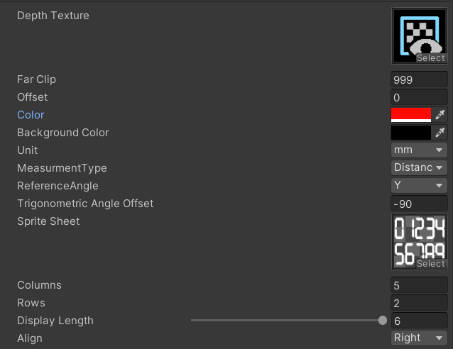
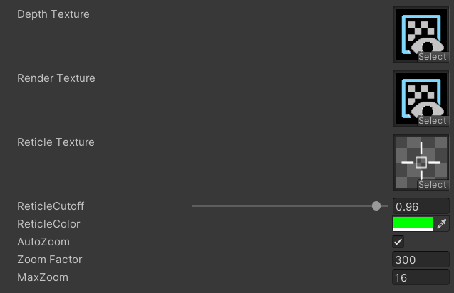

# Shader Documentation
## Distance Display Shader (hygn/LDF/DistanceFinder)

* Depth Texture : Depth Texture that Depth Camera Renders *1
* Far Clip: Far Clip Value of Depth Camera
* Offset: Distance Offset Value in mm
* Color: Text Color
* Background Color: Background Color (Increase alpha value greater than threshold to use background)
* Unit: Measurment Unit (mm / 10mil (1/100in))
* MeasurmentType: Measurment Mode (Distance, Trigonometric, Angle) *2
* ReferenceAngle: Reference Normal Vector direction for Trigonometric and Angle measurment
* Trigonometric Angle Offset: Angle Offset for Trigonometric measurment
* Sprite Sheet: Number Sprite Sheet
## View Finder Shader (hygn/LDF/TargetViewer)

* Depth Texture : Depth Texture that Depth Camera Renders *1
* RenderTexture: View Finder Texture that View Finder Camera Renders *1
* Reticle Texture: Reticle Texture
* Reticle Cutoff: Alpha Cutoff value of Reticle
* Reticle Color: Reticle Color
* AutoZoom: Auto Zoom-In according to distance
* ZoomFactor: Zoom in Factor
* MaxZoom: Max Zoom in
## FootNote
### *1 Camera
Camera only works only self and friends \
Ref: [https://docs.vrchat.com/docs/whitelisted-avatar-components](https://docs.vrchat.com/docs/whitelisted-avatar-components)
### *2 Trigonometric Measurment
