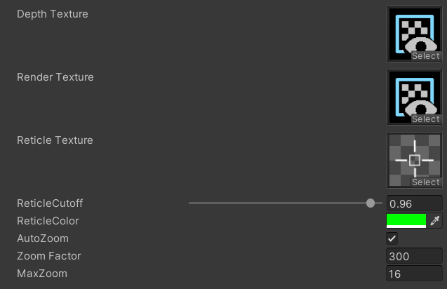

# 셰이더 설명서
## 거리 디스플레이 셰이더 (hygn/LDF/DistanceFinder)

* Depth Texture : 깊이 카메라가 렌더링하는 깊이 텍스쳐입니다
* Far Clip: 깊이 카메라의 Far Clip 값입니다
* Offset: 거리의 오프셋 값입니다 (mm)
* Color: 글자 색입니다
* Background Color: 배경 색입니다 (알파 값을 일정 이상 올려야 배경이 나타납니다.)
* Unit: 측정 단위입니다 (mm / 10mil (1/100in))
* MeasurmentType: 측정 모드입니다 (거리, 삼각함수, 각도) *1
* ReferenceAngle: 삼각함수, 각도 측정에 사용할 기준 법선 방향입니다
* Trigonometric Angle Offset: 삼각함수 측정에 사용할 각도 오프셋입니다
* Sprite Sheet: 숫자 스프라이트 시트입니다.
## 뷰파인더 셰이더 (hygn/LDF/TargetViewer)

* Depth Texture : 깊이 카메라가 렌더링하는 깊이 텍스쳐입니다
* RenderTexture: 뷰파인더 카메라가 렌더링하는 텍스쳐입니다
* Reticle Texture: 레티클 텍스쳐입니다
* Reticle Cutoff: 레티클의 알파 컷오프 값입니다
* Reticle Color: 레티클 색깔입니다
* AutoZoom: 거리에 따른 자동 확대 기능입니다
* ZoomFactor: 확대할 정도입니다
* MaxZoom: 최대 배율입니다
## 각주
### *1 카메라
카메라는 자기 자신과 친구에게서만 작동됩니다 \
Ref: [https://docs.vrchat.com/docs/whitelisted-avatar-components](https://docs.vrchat.com/docs/whitelisted-avatar-components)
### *2 삼각함수 측정
