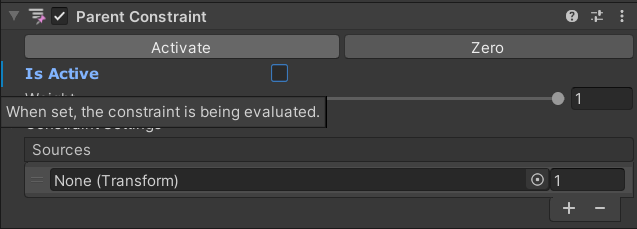
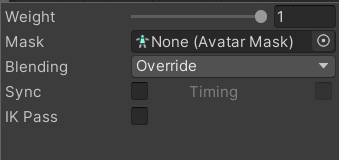
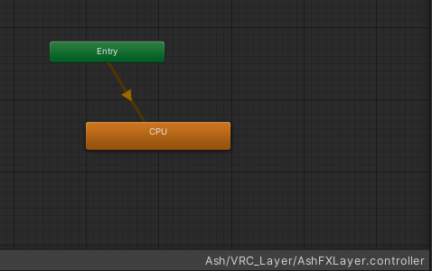

# VRC System Monitor Manual
## -1. READ PRECAUTIONS
[https://booth.hygn.moe/SystemMonitor/Precautions.html](https://booth.hygn.moe/SystemMonitor/Precautions.html)
## 0. Import liltoon shader to your Unity project
If liltoon shader is not in your Unity project, you must import liltoon shader first.
## 1. Import Unitypackage to your Unity project

## 2. Drag prefab into avatar root

## 3. Uncheck "Is Active" in parent constraints

## 4. Adjust position of prefab 

## 5. Assign left lower arm bone to parent constraints

## 6. Click "Activate" in parent constraints

## 7. Disable prefab in inspector

## 8. Open FX layer of your avatar

## 9. Add parameters to FX layer
\
**All parameters are case-sensitive.**
* SysStatus_CPU (float)
* SysStatus_RAM (float)
* SysStatus_GPU (float)
* SysStatus_VRAM (float)
* SysStatus_GPUPwr (float)
* SysStatus_GPUTemp (float)
* SysStatus_Hr (float)
* SysStatus_Min (float)
## 10. Add all layers in example controller into FX layer

## 11. Set all layer weight to 1

## 12. Copy animation controller from provided example controller and paste into FX layer

## 13. repeat 12 with "SysStatusControl" layer
*If you want to turn on or off with Expression Menu, it is recommended to make an idle state in the FX layer first and paste the example controller.*\

## 14. Add parameters into Expression Parameter

## 15. Start contained VRC_SysStatus_GUI.exe
\
*Configure software according to Software Manual*
## 16. Reset OSC settings in VRChat after upload and check OSC is working properly