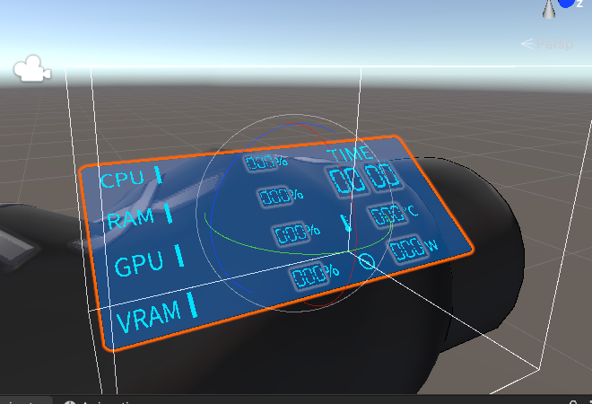
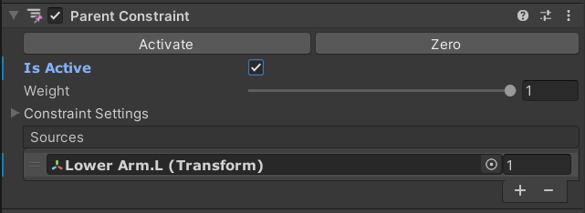
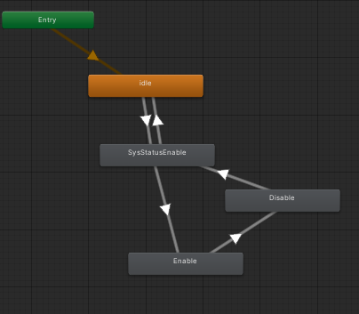

# VRC System Monitor 설명서
## -1. 유의사항 읽기
[https://booth.hygn.moe/SystemMonitor/Precautions.html](https://booth.hygn.moe/SystemMonitor/Precautions.html)
## 0. Unity 프로젝트에 liltoon 셰이더 임포트 하기
Unity 프로젝트에 liltoon 셰이더가 없다면 liltoon셰이더를 먼저 임포트 해야합니다.
## 1. Unity 프로젝트에 Unitypackage 가져오기

## 2. 프리팹을 아바타에 끌어 넣기

## 3. parent constraints 의 "Is Active" 체크를 해제하기

## 4. 프리팹의 위치를 알맞게 조절하기

## 5. left lower arm 을 parent constraints 의 Source에 적용하기

## 6. parent constraints 의 "Activate"를 눌러 활성화하기

## 7. inspector에서 프리팹을 비활성화 하기

## 8. 아바타의 FX레이어를 열기

## 9. FX레이어에 파라미터 추가하기
\
**All parameters are case-sensitive.**
* SysStatus_CPU (float)
* SysStatus_RAM (float)
* SysStatus_GPU (float)
* SysStatus_VRAM (float)
* SysStatus_GPUPwr (float)
* SysStatus_GPUTemp (float)
* SysStatus_Hr (float)
* SysStatus_Min (float)
## 10. EcampleController의 모든 레이어를 FX layer에 만들기

## 11. 레이어의 weight를 1로 설정하기

## 12. 동봉된 example controller의 애니메이션 컨트롤러를 복사 후 FX레이어에 붙여넣기

## 13. "SysStatusControl" 레이어에도 12의 작업 시행
*If you want to turn on or off with Expression Menu, it is recommended to make an idle state in the FX layer first and paste the example controller.*\

## 14. Expression 파라미터에 파라미터 추가하기

## 16. VRC_SysStatus_Normal.exe 실행하기
*빈 검은 창이 정상입니다*
## 17. 아바타 업로드 후 OSC를 초기화 하고, OSC가 잘 동작하는지 확인하기
