# VRC System Monitor 설명서
## 0. Unity 프로젝트에 liltoon 셰이더 임포트 하기
Unity 프로젝트에 liltoon 셰이더가 없다면 liltoon셰이더를 먼저 임포트 해야합니다.
## 1. Unity 프로젝트에 Unitypackage 가져오기
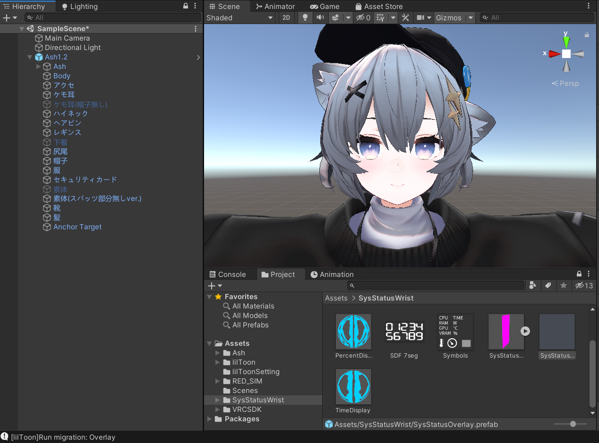
## 2. 프리팹을 아바타에 끌어 넣기
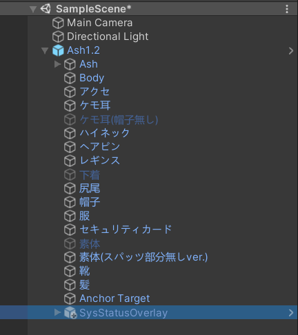
## 3. parent constraints 의 "Is Active" 체크를 해제하기
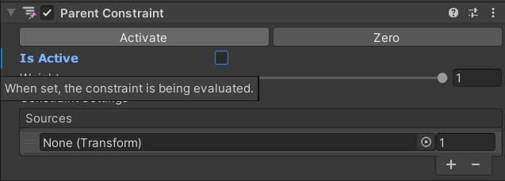
## 4. 프리팹의 위치를 알맞게 조절하기
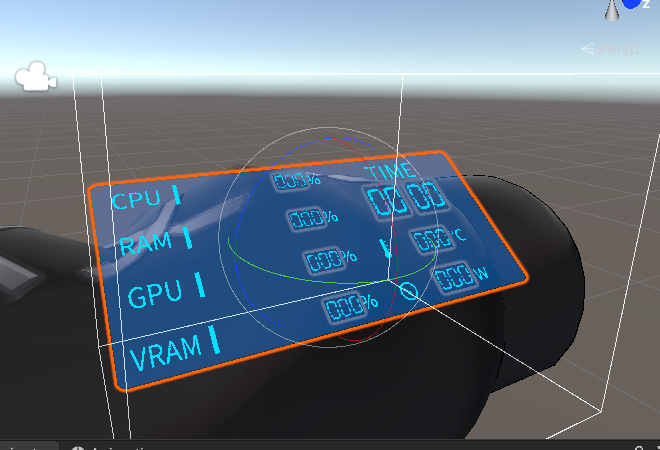
## 5. left lower arm 을 parent constraints 의 Source에 적용하기
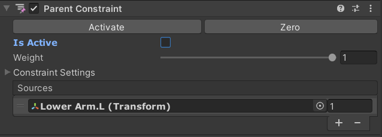
## 6. parent constraints 의 "Activate"를 눌러 활성화하기
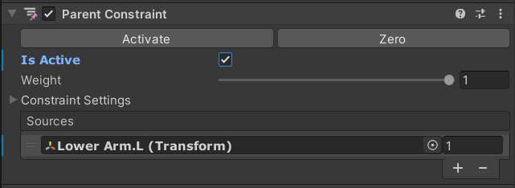
## 7. inspector에서 프리팹을 비활성화 하기
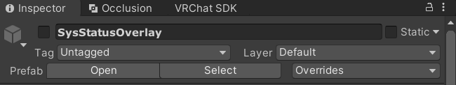
## 8. 아바타의 FX레이어를 열기
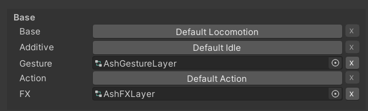
## 9. FX레이어에 파라미터를 추가히기
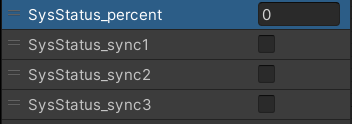\
**모든 파라미터는 대소문자를 구별합니다**
* SysStatus_percent (float)
* SysStatus_sync1 (bool)
* SysStatus_sync2 (bool)
* SysStatus_sync3 (bool)
## 10. FX레이어에 레이어 2개 추가하기
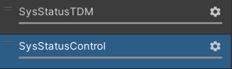\
## 11. 레이어의 weight를 1로 맞추기
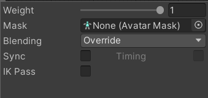
## 12. 동봉된 example controller의 애니메이션 컨트롤러를 복사 후 FX레이어에 붙여넣기
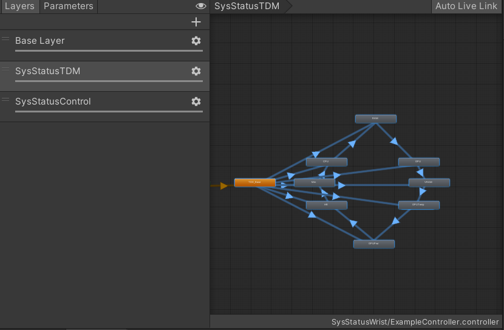
## 13. "TDD_Base" 상태를 기본 상태로 설정하기
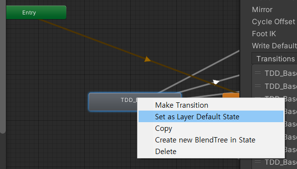
## 14. "SysStatusControl" 레이어에도 12,13의 작업 시행
*Expression 메뉴를 통해 켜고 끄기를 원한다면 사진처럼 idle상태를 만든 후 붙여넣는것을 추천합니다.*\
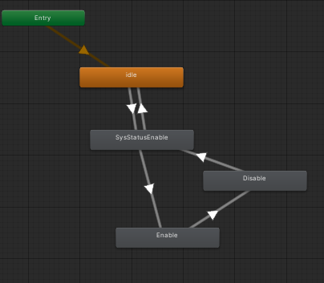
## 15. Expression 파라미터에 파라미터 추가하기
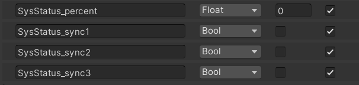
## 16. VRC_SysStatus_TDD.exe 실행하기
*빈 검은 창이 정상입니다*
## 17. 아바타 업로드 후 OSC를 초기화 하고, OSC가 잘 동작하는지 확인하기
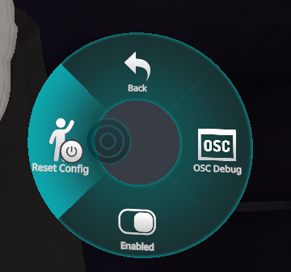
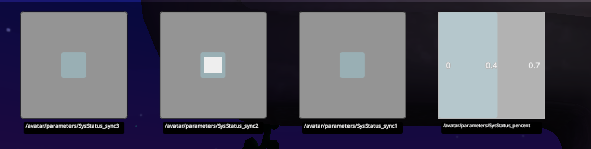