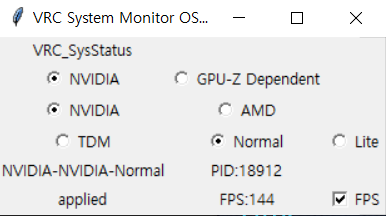

# Software Manual

## NVIDIA
Only supports NVIDIA GPU\
Requires NVSMI. Please read precautions
## GPUZDependent
Supports Both NVIDIA and AMD GPU through GPU-Z
## NVIDIA
Select Vendor
## AMD
Select Vendor
## TDM
For TDM Version
## Normal
For Normal Version
## Lite
For Lite Version (Not Yet Released)
## FPS
For FPS mode, please check FPS
## Automatic Config save/load
This software generates a *SysStatus.cfg.json* file to store the current configuration.\
When startup, the software automatically reads the config file and restores the previous configuration.
## Special notice for GPU-Z Dependent mode
Download and Install GPU-Z from techpowerup\
Go to "Sensors" Tab and click Bottom Left "Log To File"\
Make sure the file name is "GPU-Z Sensor Log.txt" and in the same directory with "VRC_SysStatus_TDD_GUI.exe" file\
Click "Save"\
Start EXE file\
*Deleting log file after using is highly recommended for optimal performance*
## Special notice for PresentMon.dll
included PresentMon.dll is must be in the same directory with exe file

# 소프트웨어 매뉴얼

## NVIDIA
NVIDIA GPU만 지원합니다\
NVSMI 가 필요합니다 Precautions를 읽어주세요
## GPUZDependent
GPU-Z를 통해서 NVIDIA 및 AMD GPU를 지원합니다.
## NVIDIA
알맞은 제조사를 선택하세요.
## AMD
알맞은 제조사를 선택하세요.
## TDM
TDM 버전 모드 입니다.
## Normal
Normal 버전 모드 입니다.
## Lite
Lite 버전 모드 입니다. (출시 예정입니다.)
## FPS
FPS를 사용할 경우 FPS를 체크해주세요
## 설정 유지 기능
이 소프트웨어는 자동으로 *SysStatus.cfg.json* 파일을 생성하고 해당 파일에 현재 설정을 저장합니다.\
소프트웨어를 시작할 때 설정 파일을 읽고 이전 설정을 자동으로 복원합니다.
## GPU-Z Dependent에 대한 추가 유의 사항
Techpowerup 에서 GPU-Z를 다운로드 후 설치합니다\
"Sensors" 탭에서 좌 하단의 "Log To File"을 클릭합니다\
파일 이름이 "GPU-Z Sensor Log.txt" 이고 "VRC_SysStatus_TDD_GPUZDependent.exe" 와 같은 디렉터리에 있는지 확인합니다.\
"저장" 을 클릭합니다\
EXE 파일을 실행합니다\
*최적의 성능을 위해 사용 후 로그 파일을 삭제하는것을 추천합니다.*
## PresentMon.dll 관련 유의사항
포함된 PresentMon.dll은 exe 파일과 같은 디렉터리에 있어야합니다.
